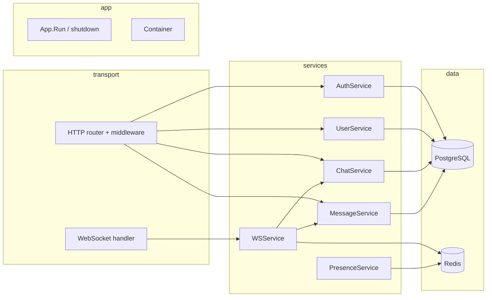

# GoFlow — backend мессенджера (Go)

HTTP API + WebSocket для чатов (direct / group), сообщений, сессий и realtime-событий. Слой данных: **PostgreSQL** (включая transactional **outbox**) + **Redis** (presence, typing, WS tickets, rate limit, pub/sub при необходимости) + опционально **Kafka** для доставки доменных событий между инстансами.

## Архитектура

Поток запроса: **transport** (HTTP/WS) → **service** (бизнес-правила) → **repository** (Postgres / Redis). Конфигурация и DI собираются в `internal/app`.



- **Graceful shutdown**: по `SIGINT`/`SIGTERM` останавливаются фоновые воркеры (outbox relay, Kafka consumer при включении), отменяется Redis relay (`PSUBSCRIBE`), закрываются активные WebSocket (`Hub`), затем `http.Server.Shutdown` с таймаутом 15s.
- **Rate limiting**: token bucket (`golang.org/x/time/rate`) **по IP** (хост из `RemoteAddr`) для `POST /auth/login`, `POST /auth/register`, `POST /chats/{id}/messages`, `GET /ws/connect`. Лимиты задаются в `configs/*.yaml` и через env (см. ниже). Ответ **429** в том же JSON-формате ошибок, код `rate_limited`.

## Структура репозитория

```
GoFlow/
├── README.md                 ← этот файл
└── backend/
    ├── cmd/app/main.go       ← точка входа: конфиг, pool, container, signal context
    ├── configs/local.yaml    ← пример конфигурации (порт, DSN, Redis, JWT, rate_limit)
    ├── internal/
    │   ├── app/              ← Container + сборка HTTP/WS + Run (shutdown)
    │   ├── config/           ← YAML + env overrides + валидация
    │   ├── domain/           ← сущности без транспорта/SQL
    │   ├── dto/              ← JSON request/response
    │   ├── repository/       ← интерфейсы; postgres/, redis/
    │   ├── service/          ← бизнес-логика + unit-тесты с моками
    │   ├── transport/http/   ← router, handlers, middleware, docs (openapi.yaml + /docs)
    │   ├── transport/ws/     ← hub, client, broadcaster, события
    │   ├── kafka/            ← модель события для брокера
    │   ├── worker/           ← outbox relay, kafka→WS consumer
    │   ├── migration/        ← *.sql + runner (schema_migrations)
    │   ├── observability/metrics ← Prometheus (HTTP, WS, auth, messages, Kafka/outbox)
    │   └── pkg/              ← jwt, password, errors, response, logger, validator
    ├── deployments/
    │   ├── Dockerfile        ← context: каталог backend/
    │   ├── docker-compose.yml
    │   ├── prometheus/prometheus.yml
    │   ├── loki/loki-config.yaml
    │   ├── alloy/config.alloy
    │   └── grafana/          ← provisioning + dashboards (JSON)
    ├── api/                    ← указатель на OpenAPI (см. README в каталоге)
    ├── .env.example
    └── go.mod
```

**Связка контейнера** (`internal/app/container.go`): при непустом `POSTGRES_DSN` создаются Postgres-репозитории; при непустом `REDIS_ADDR` — клиент Redis, ping, репозитории presence / typing / pubsub. `main` передаёт в `NewContainer` пул из `postgres.NewPool`; при ошибке контейнера приложение не стартует.

## Как запустить локально

1. Поднять Postgres и Redis (и при полном стеке — Kafka, см. `docker compose`).
2. Миграции: при `runtime.run_migrations_on_startup: true` в YAML или `RUN_MIGRATIONS_ON_STARTUP=true` они выполняются при старте процесса (`migration.Up`). Иначе примените SQL из `backend/internal/migration/` вручную к базе.
3. Скопировать `backend/.env.example` в `.env` при необходимости и выставить переменные **или** править `backend/configs/local.yaml`.
4. Из каталога `backend/`:

```bash
export CONFIG_PATH="${CONFIG_PATH:-configs/local.yaml}"
# при необходимости: POSTGRES_DSN, REDIS_ADDR, JWT_SECRET, HTTP_PORT, KAFKA_*, RUN_MIGRATIONS_ON_STARTUP
go run ./cmd/app
```

Сервис слушает порт из конфига (по умолчанию **8080**).

Контракт WebSocket (envelope, `message.read` vs `message.read_receipt`, ticket flow): [`backend/docs/WS_CONTRACT_V1.md`](backend/docs/WS_CONTRACT_V1.md). Краткая связка HTTP ↔ ticket ↔ connect: [`backend/docs/WS_PROTOCOL.md`](backend/docs/WS_PROTOCOL.md).

## OpenAPI / Swagger (только HTTP API)

- **Источник правды:** файл [`backend/internal/transport/http/docs/openapi.yaml`](backend/internal/transport/http/docs/openapi.yaml) (OpenAPI 3.0). Он вшивается в бинарник через `go:embed`; при правках пересоберите приложение (`go run` / `docker compose build`).
- **Swagger UI:** после старта приложения откройте в браузере `http://localhost:8080/docs` (порт из `HTTP_PORT` / конфига).
- **Сырой YAML:** `http://localhost:8080/openapi.yaml` — для импорта в Postman, codegen и т.д.
- **Авторизация в Swagger UI:** кнопка **Authorize** → в поле `bearerAuth` вставьте значение **`access_token`** из ответа `POST /auth/login` или `POST /auth/register` (без префикса `Bearer ` — Swagger добавит схему сам). Для публичных маршрутов (`/auth/register`, `/auth/login`, `/auth/refresh`, `/auth/logout`, `/health`, `/docs`, `/openapi.yaml`) авторизация не нужна.
- **Ошибки API:** единый JSON `{ "error": { "code", "message", "details" } }` описан в компонентах спецификации; отдельно **429** с `code: rate_limited` (middleware). **WebSocket** и бинарные кадры в OpenAPI не дублируются; HTTP-часть ticket/connect задокументирована, детали кадров — в `WS_CONTRACT_V1.md` / `WS_PROTOCOL.md`.

Примеры ручной проверки после авторизации в UI:

1. **GET `/users/me`** — профиль текущего пользователя.
2. **GET `/chats`** — список чатов.
3. **POST `/chats/direct`** с телом `{ "user_id": "<uuid другого пользователя>" }` — direct-чат.

## Docker

Из каталога `backend/deployments/`:

```bash
docker compose up --build
```

Образ собирается с **контекстом** `backend/` (см. `dockerfile: deployments/Dockerfile` в compose). В контейнер кладётся `configs/local.yaml`; DSN, Redis и Kafka переопределяются env из compose (`postgres`, `redis`, `kafka` как hostname). По умолчанию в compose включены **`KAFKA_ENABLED=true`**, **`RUN_MIGRATIONS_ON_STARTUP=true`** и allowlist для WS (`WS_ALLOWED_ORIGINS`).

### Observability (Prometheus, Grafana, Loki, Grafana Alloy)

Из `backend/deployments/` поднимается расширенный стек: **app**, **postgres**, **redis**, **kafka**, **prometheus**, **grafana**, **loki**, **alloy**. Логи контейнеров собирает **Grafana Alloy** (Docker socket → Loki), без Promtail.

| URL | Назначение |
|-----|------------|
| http://localhost:9090 | Prometheus UI и targets |
| http://localhost:3001 | Grafana (логин/пароль по умолчанию `admin` / `admin`, см. `GRAFANA_*` в compose) |
| http://localhost:3100 | Loki HTTP API |
| http://localhost:12345 | Alloy HTTP (метрики Alloy) |

Проверка метрик приложения: `curl -s http://localhost:8080/metrics | head` (или порт из `HTTP_PORT`). В Grafana после старта уже подключены datasources **Prometheus** и **Loki** и три дашборда в папке **GoFlow**: *Backend Overview*, *Realtime / Messaging*, *Logs Overview*. LogQL в логах использует метку `container_name` (подбор `.*app.*` для сервиса `app` в compose).

Конфиги как код: `deployments/prometheus/prometheus.yml`, `deployments/loki/loki-config.yaml`, `deployments/alloy/config.alloy`, `deployments/grafana/provisioning/`, `deployments/grafana/dashboards/*.json`.

Логи приложения: при `LOG_FORMAT=json` (в compose для `app` по умолчанию) в stdout идёт JSON со полями `service`, `env`, `time`, `level`, `msg` / `message` и полями HTTP в middleware (`http.method`, `http.path`, `http.status`, …). Секреты и токены в лог не пишутся.

## HTTP API (основные endpoints)

| Метод | Путь | Auth | Описание |
|--------|------|------|----------|
| GET | `/health` | нет | Liveness |
| GET | `/metrics` | нет | Prometheus scrape (метрики процесса + HTTP/WS/auth/messages/outbox/Kafka) |
| POST | `/auth/register` | нет | Регистрация |
| POST | `/auth/login` | нет | Логин, выдача токенов |
| POST | `/auth/refresh` | нет | Обновление access; **rotation** refresh (старый отзывается, в теле ответа новый `refresh_token`) |
| POST | `/auth/logout` | нет | Выход (текущая сессия) |
| POST | `/auth/logout-all` | Bearer | Завершить все сессии |
| GET/PATCH | `/users/me` | Bearer | Профиль |
| GET | `/users/search` | Bearer | Поиск пользователей (без `password_hash` в SQL) |
| GET | `/users/{id}` | Bearer | Публичные поля пользователя по id |
| GET | `/chats` | Bearer | Список чатов |
| POST | `/chats/direct` | Bearer | Direct-чат |
| POST | `/chats/group` | Bearer | Группа |
| GET | `/chats/{chat_id}` | Bearer | Карточка чата |
| GET/POST | `/chats/{chat_id}/members` | Bearer | Участники / добавить |
| DELETE | `/chats/{chat_id}/members/{user_id}` | Bearer | Исключить участника |
| GET | `/chats/{chat_id}/messages` | Bearer | История сообщений |
| POST | `/chats/{chat_id}/messages` | Bearer | Отправить сообщение |
| GET/PATCH/DELETE | `/messages/{message_id}` | Bearer | Сообщение / правка / удаление |
| POST | `/messages/{message_id}/read` | Bearer | Прочитано |
| POST | `/ws/ticket` | Bearer | Выдать короткоживущий одноразовый ticket для WS |
| GET | `/ws/connect` | query `ticket=…` (лимит по IP) | WebSocket upgrade |

Заголовок авторизации: `Authorization: Bearer <access_jwt>`.

## WebSocket

1. Получить **access** JWT через `POST /auth/login` (или register + login).
2. `POST /ws/ticket` с `Authorization: Bearer <access>` → в ответе opaque **ticket** и `expires_in`.
3. Подключиться: `GET /ws/connect?ticket=<ticket>` (JWT в query **не используется**).
4. После upgrade соединение регистрируется в **Hub**. Ticket в Redis удаляется при успешном consume (**одноразовый**).
5. Входящие кадры — JSON-команды; исходящие — envelope `{ "event", "data", "meta" }` (см. `docs/WS_CONTRACT_V1.md`). Исходящие по сообщениям: `message.created`, `message.updated`, `message.deleted`, `message.read_receipt`; входящее прочтение: **`message.read`** (имя отличается от receipt).
6. **Межинстансовая** доставка событий сообщений: PostgreSQL **outbox** → relay → **Kafka** (ключ партиции — `chat_id` для порядка в рамках чата) → consumer в том же процессе → тот же envelope в Hub. Redis остаётся для presence/typing/tickets/rate limit; доменные события сообщений не «основной транспорт» через Redis-pubsub при включённом Kafka.

При остановке сервера соединения закрываются на стороне сервера, клиенты получают обрыв read loop.

## Kafka и outbox

- Таблица `outbox_events`: запись в **той же транзакции**, что и изменение сообщения / read state (`MessageWriter` в Postgres).
- Воркер **`OutboxRelay`** читает pending-строки, сериализует **`internal/kafka.DomainEvent`**, публикует в топик (по умолчанию `goflow.domain.events`) и помечает строку **published**.
- Если `kafka.enabled: false`, relay шлёт envelope напрямую в локальный `Broadcaster` (удобно без брокера).
- **`KafkaWSConsumer`**: для fan-out на **каждый** инстанс приложения процесс получает свой **уникальный** `consumer group` (`KAFKA_CONSUMER_GROUP` как префикс + UUID), иначе общая группа распределила бы партиции между репликами и часть WS-клиентов не увидела бы события. Читает топик и вызывает `Broadcaster.DeliverEnvelopeBytes` локально.

Переменные: `KAFKA_ENABLED`, `KAFKA_BROKERS` (через запятую для нескольких), `KAFKA_TOPIC`, `KAFKA_CONSUMER_GROUP`, плюс секция `kafka:` в YAML.

## Конфигурация и env

Файл по умолчанию: `configs/local.yaml`, путь переопределяется `CONFIG_PATH`.

Переменные окружения (частичный список): `HTTP_PORT`, `POSTGRES_DSN`, `REDIS_ADDR`, `JWT_SECRET`, `JWT_ACCESS_TTL_SECONDS`, `JWT_REFRESH_TTL_SECONDS`, `RUN_MIGRATIONS_ON_STARTUP`, `KAFKA_ENABLED`, `KAFKA_BROKERS`, `KAFKA_TOPIC`, `KAFKA_CONSUMER_GROUP`, `WS_ALLOWED_ORIGINS`, **`SERVICE_NAME`**, **`APP_ENV`**, **`LOG_FORMAT`** (`json` \| `text`), лимиты: `RATE_LIMIT_*`, в т.ч. `RATE_LIMIT_WS_CONNECT_PER_MINUTE` для выдачи ticket и upgrade. Для Grafana: `GRAFANA_PORT`, `GRAFANA_ADMIN_USER`, `GRAFANA_ADMIN_PASSWORD`, `GRAFANA_ROOT_URL`.

Секция YAML **`observability`** (`service_name`, `env`, `log_format`) дублирует часть настроек логов; env имеет приоритет при merge в `config.Load`.

Секция YAML `rate_limit` (значения в **запросах в минуту на IP**); если в файле не задано или ≤0, подставляются дефолты в `config.Load` после merge с env.

## Что умеет MVP (кратко)

- Регистрация / вход / refresh / logout, JWT access + refresh-сессии в БД.
- Пользователи: «я», обновление профиля, поиск, просмотр по id.
- Чаты: direct (с дедупликацией пары), group, участники, последнее сообщение.
- Сообщения: отправка, правка/удаление автором, ответы в рамках чата, read state; типы **text** и **system** в MVP (**image** / **file** отклоняются валидацией до вложений).
- WebSocket: realtime-события, при наличии Redis — typing, presence, межинстансовая доставка через pub/sub.
- Наблюдаемость: **Prometheus** (`/metrics`: HTTP latency/inflight/status_class, WS connections и события, auth, сообщения, outbox relay, Kafka consumer), структурированные логи (**JSON** в docker-compose), **Grafana** + **Loki** + **Grafana Alloy** в compose.
- Логирование запросов, recovery от паник, единый JSON для ошибок API.
- Ограничение частоты на чувствительных маршрутах и **аккуратное завершение** HTTP + WS + relay.

---

Подробный разбор файлов и порядок разработки можно вести в wiki или отдельной доке; для демо достаточно этого README и рабочего `docker compose`.
