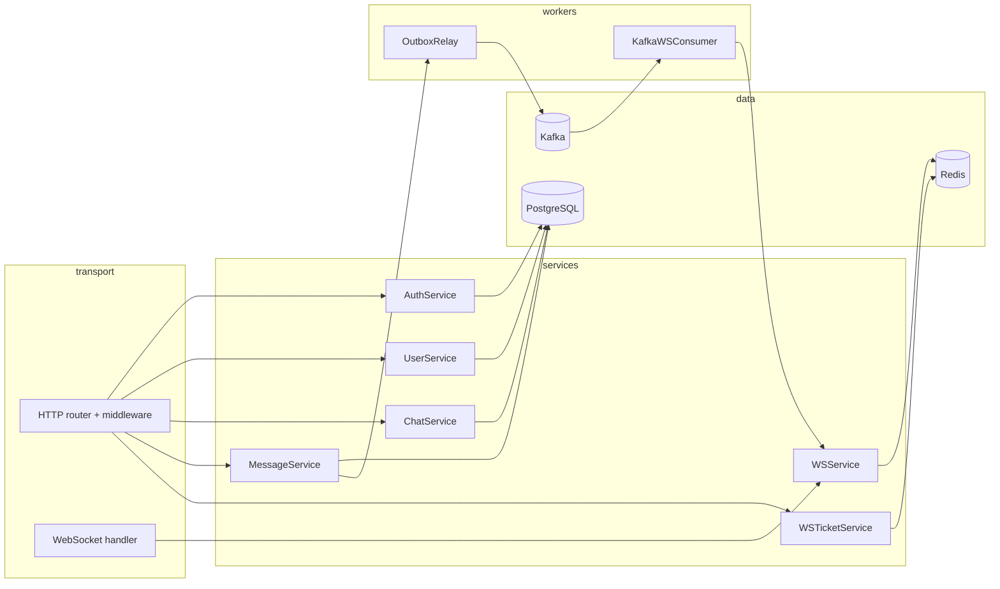

# gomsg

**Production-grade real-time messaging backend in Go** — HTTP API + WebSocket, PostgreSQL with transactional outbox, Kafka fan-out across replicas, and a full Prometheus/Grafana/Loki observability stack.

[](https://github.com/Ilpaka/gomsg/actions/workflows/ci.yml)
[](https://go.dev/)
[](https://golangci-lint.run/)
[](backend/deployments/docker-compose.yml)

> 🇷🇺 Русская версия — [README.ru.md](README.ru.md)

---

## Overview

`gomsg` is a backend service for a chat application: direct and group chats, message CRUD with read receipts, user profiles, JWT auth with refresh-token rotation, and WebSocket-driven real-time updates. It is designed to run as **multiple replicas behind a load balancer** — events published by one replica reach WebSocket clients connected to any other replica via a transactional outbox + Kafka fan-out.

Why it is interesting technically:

- **Event delivery survives crashes.** Messages and their domain events are inserted in the same SQL transaction (outbox pattern). A background relay publishes pending rows to Kafka and only then marks them as delivered. Nothing is lost between "row written" and "WebSocket emitted".
- **Multi-replica WebSocket fan-out.** Each app instance uses its own Kafka consumer group (suffixed with a UUID) so every replica receives every event and broadcasts it to its local WebSocket hub.
- **Defence-in-depth on the WS handshake.** Clients exchange their JWT for a one-time, short-lived ticket in Redis (`SETNX` + `GETDEL`), so the access token never ends up in a URL or browser history.
- **Production-ready observability.** 18 Prometheus collectors (HTTP latency/inflight/status class, WS connections and events, auth attempts, message lifecycle, outbox relay, Kafka consumer), three provisioned Grafana dashboards, Loki + Grafana Alloy for log aggregation.
- **Clean error model.** Typed `apperr` errors map to HTTP status codes and a unified `{ "error": { "code", "message", "details" } }` envelope. Validation surfaces structured field violations.

## Key Features

- **Authentication** — JWT (HS256) access + DB-stored refresh sessions with rotation on every refresh, bcrypt password hashing, `logout` and `logout-all`.
- **Chats** — direct chats (de-duplicated by ordered user pair), group chats, member roles, last-message preview, read state.
- **Messages** — send/edit/delete by author, replies within a chat, read receipts, soft delete; types `text` and `system` (image/file rejected by validation until attachments land).
- **WebSocket** — one-time Redis-backed tickets for upgrade, hub-based broadcast, per-event metrics, graceful close on shutdown.
- **Transactional outbox + Kafka** — `outbox_events` table written inside the same tx, relay worker, Kafka topic keyed by `chat_id` for in-chat ordering, optional (Kafka can be disabled — relay then publishes directly to the local broadcaster).
- **Rate limiting** — `golang.org/x/time/rate` token-bucket per IP, per route (`/auth/register`, `/auth/login`, `/chats/{id}/messages`, `/ws/connect`), responses use the same JSON envelope with `code: rate_limited`.
- **Observability** — Prometheus metrics at `/metrics`, structured `log/slog` logs with `X-Request-ID` propagation, Grafana dashboards provisioned out-of-the-box, Loki via Grafana Alloy.
- **Graceful shutdown** — `SIGINT`/`SIGTERM` stops background workers (outbox relay, Kafka consumer), cancels Redis pub/sub, closes WebSocket hub, then `http.Server.Shutdown` with a 15s timeout.
- **OpenAPI 3 spec** — hand-maintained, embedded via `go:embed`, served as Swagger UI at `/docs` and raw YAML at `/openapi.yaml`.

## Architecture

Request flow: **transport** (HTTP / WS) → **service** (business rules, validation) → **repository** (PostgreSQL / Redis). Wiring lives in `internal/app/container.go`.



For an end-to-end walk-through (REST send → outbox → Kafka → WS broadcast) see [`docs/01_PROJECT_OVERVIEW.md`](docs/01_PROJECT_OVERVIEW.md).

## Tech Stack

| Layer            | Technology                                                   |
| ---------------- | ------------------------------------------------------------ |
| Language         | Go 1.25                                                      |
| HTTP             | `net/http` + `http.ServeMux` (Go 1.22 routing)               |
| WebSocket        | `gorilla/websocket`                                          |
| Database         | PostgreSQL 16, `jackc/pgx/v5` (connection pool)              |
| Cache / Pub-sub  | Redis 7, `redis/go-redis/v9`                                 |
| Message bus      | Kafka 7.6.1, `segmentio/kafka-go` (optional)                 |
| Auth             | `golang-jwt/jwt/v5` (HS256), bcrypt via `golang.org/x/crypto` |
| Logging          | `log/slog` (JSON / text)                                     |
| Metrics          | `prometheus/client_golang`                                   |
| Rate limiting    | `golang.org/x/time/rate`                                     |
| Config           | YAML + env overrides (`gopkg.in/yaml.v3`)                    |
| Testing          | `testing` + `t.Parallel()`, hand-rolled mocks, `miniredis/v2` |
| Linting          | `golangci-lint` (errcheck, govet, staticcheck, revive, …)    |
| CI               | GitHub Actions (lint, test with race, build, Docker)         |
| Containers       | Multi-stage Dockerfile (Alpine, non-root, `-trimpath -ldflags="-s -w"`) |
| Observability    | Prometheus, Grafana (provisioned dashboards), Loki, Grafana Alloy |

## Quick Start

Prerequisites: Docker + Docker Compose. Go 1.25 only required if you want to run outside Docker.

```bash
git clone https://github.com/Ilpaka/gomsg.git
cd gomsg
make docker-up
```

Once the stack is healthy:

| Service       | URL                                  |
| ------------- | ------------------------------------ |
| API           | http://localhost:8080                |
| Swagger UI    | http://localhost:8080/docs           |
| OpenAPI YAML  | http://localhost:8080/openapi.yaml   |
| Prometheus    | http://localhost:9090                |
| Grafana       | http://localhost:3001 (`admin`/`admin`) |
| Loki API      | http://localhost:3100                |

To run the app without Docker (Postgres and Redis must already be reachable):

```bash
make run   # CONFIG_PATH=backend/configs/local.yaml go run ./cmd/app
```

Tear everything down:

```bash
make docker-down
```

## Project Structure

```
gomsg/
├── README.md / README.ru.md
├── Makefile
├── .golangci.yml
├── .github/workflows/ci.yml
├── docs/                          # extended documentation (5 docs + index)
└── backend/
    ├── cmd/app/main.go            # entrypoint: config → pool → migrations → container → app
    ├── configs/local.yaml         # default config (port, DSN, Redis, JWT, rate limits, Kafka, observability)
    ├── .env.example
    ├── internal/
    │   ├── app/                   # Container + HTTP/WS wiring + Run/Shutdown
    │   ├── config/                # YAML + env overrides + validation
    │   ├── domain/                # entities (User, Chat, Message, Session, OutboxEvent, …)
    │   ├── dto/                   # request/response shapes
    │   ├── repository/            # interfaces; postgres/, redis/ implementations
    │   ├── service/               # business logic + unit tests with mocks
    │   ├── transport/http/        # router, handlers, middleware, embedded openapi.yaml
    │   ├── transport/ws/          # hub, client, broadcaster, events
    │   ├── kafka/                 # DomainEvent + producer
    │   ├── worker/                # OutboxRelay, KafkaWSConsumer
    │   ├── migration/             # *.sql + runner (schema_migrations table)
    │   ├── observability/metrics/ # Prometheus collectors and middleware
    │   └── pkg/                   # jwt, password, errors (apperr), response, logger, validator
    └── deployments/
        ├── Dockerfile             # multi-stage, non-root, ~15 MB image
        ├── docker-compose.yml     # app + postgres + redis + kafka + prometheus + grafana + loki + alloy
        ├── prometheus/, loki/, alloy/, grafana/  # provisioned configs and dashboards
```

## HTTP API

The full contract lives in [`backend/internal/transport/http/docs/openapi.yaml`](backend/internal/transport/http/docs/openapi.yaml) (1,400+ lines) and is served as Swagger UI at `http://localhost:8080/docs`. Selected endpoints:

| Method      | Path                                        | Auth   | Notes                                                        |
| ----------- | ------------------------------------------- | ------ | ------------------------------------------------------------ |
| `POST`      | `/auth/register`                            | —      | Email + nickname + password (validated server-side)          |
| `POST`      | `/auth/login`                               | —      | Returns `access_token` + `refresh_token`                     |
| `POST`      | `/auth/refresh`                             | —      | Refresh with rotation: the old refresh is revoked            |
| `POST`      | `/auth/logout-all`                          | Bearer | Terminate all active sessions for the current user           |
| `GET/PATCH` | `/users/me`                                 | Bearer | Profile read / partial update                                |
| `POST`      | `/chats/direct`                             | Bearer | Idempotent by ordered user pair                              |
| `POST`      | `/chats/group`                              | Bearer | Group chat with members                                      |
| `GET/POST`  | `/chats/{id}/messages`                      | Bearer | History / send                                               |
| `POST`      | `/messages/{id}/read`                       | Bearer | Read receipt                                                 |
| `POST`      | `/ws/ticket`                                | Bearer | Issue one-time ticket for WS upgrade                         |
| `GET`       | `/ws/connect?ticket=…`                      | ticket | WebSocket upgrade — ticket consumed atomically               |
| `GET`       | `/metrics`                                  | —      | Prometheus text exposition                                   |
| `GET`       | `/health`                                   | —      | Liveness probe                                               |

All responses use a unified envelope:

```json
// success
{ "ok": true, "data": { /* ... */ } }

// error
{ "error": { "code": "validation_failed", "message": "...", "details": { /* optional */ } } }
```

Error codes: `unauthorized`, `forbidden`, `not_found`, `validation_failed`, `conflict`, `internal`, `rate_limited`.

## WebSocket Protocol

1. `POST /auth/login` → `access_token`.
2. `POST /ws/ticket` with `Authorization: Bearer <access>` → opaque `ticket` + `expires_in` (default 120 s).
3. `GET /ws/connect?ticket=<ticket>` — the access token is **never** sent over the WebSocket URL. The ticket is consumed atomically (`GETDEL`) and the connection registers with the `Hub`.
4. Outbound frames use the envelope `{ "event", "data", "meta" }`. Event names: `message.created`, `message.updated`, `message.deleted`, `message.read_receipt`, `typing.started`, `typing.stopped`, `presence.online`, `presence.offline`.
5. Inbound command for read receipts is `message.read` (note the asymmetry with the outbound `message.read_receipt`).

Full frame contract: [`backend/docs/WS_CONTRACT_V1.md`](backend/docs/WS_CONTRACT_V1.md). Handshake reference: [`backend/docs/WS_PROTOCOL.md`](backend/docs/WS_PROTOCOL.md).

## Observability

After `make docker-up`:

- **Metrics** — `curl http://localhost:8080/metrics` shows HTTP latency / inflight / status class, WS active connections and in/out event counters, auth attempts and failures, message lifecycle counters, outbox relay iterations / publish success / publish failures, Kafka consumer success / failures.
- **Dashboards** — Grafana is provisioned with three dashboards in the **gomsg** folder: *Backend Overview*, *Realtime / Messaging*, *Logs Overview*. No manual import required.
- **Logs** — JSON via stdout (`LOG_FORMAT=json` in compose), aggregated by Grafana Alloy → Loki. Each request line carries `request_id`, `method`, `path`, `status`, `duration_ms`.

Deep dive: [`docs/04_OBSERVABILITY_STACK.md`](docs/04_OBSERVABILITY_STACK.md).

## Development

```bash
make help          # list all targets
make test          # go test ./...
make test-race     # with the race detector
make lint          # golangci-lint
make fmt           # gofmt -s -w
make build         # ./bin/app
```

Migrations are applied automatically on startup when `RUN_MIGRATIONS_ON_STARTUP=true` (default in compose). SQL files live in `backend/internal/migration/` and are tracked in the `schema_migrations` table.

CI runs lint, race tests, build, and a Docker image build on every push and pull request: [`.github/workflows/ci.yml`](.github/workflows/ci.yml).

## Documentation

| Document                                                    | What's inside                                                 |
| ----------------------------------------------------------- | ------------------------------------------------------------- |
| [`docs/00_DOCS_INDEX.md`](docs/00_DOCS_INDEX.md)            | Navigation hub                                                |
| [`docs/01_PROJECT_OVERVIEW.md`](docs/01_PROJECT_OVERVIEW.md) | Modules, data flows, MVP status                               |
| [`docs/02_REDIS_USAGE.md`](docs/02_REDIS_USAGE.md)          | Presence, typing, tickets, pub-sub — what Redis is **not** used for |
| [`docs/03_KAFKA_USAGE.md`](docs/03_KAFKA_USAGE.md)          | Outbox relay, fan-out via per-replica consumer groups         |
| [`docs/04_OBSERVABILITY_STACK.md`](docs/04_OBSERVABILITY_STACK.md) | Prometheus, Grafana, Loki, Alloy setup; LogQL examples  |
| [`docs/05_DATABASE_STRUCTURES.md`](docs/05_DATABASE_STRUCTURES.md) | Schema, indices, relationships                          |
| [`backend/docs/WS_CONTRACT_V1.md`](backend/docs/WS_CONTRACT_V1.md) | WebSocket frame contract                                |
| [`backend/docs/WS_PROTOCOL.md`](backend/docs/WS_PROTOCOL.md) | Handshake reference                                          |

## Roadmap

- OpenTelemetry distributed tracing (currently only metrics + structured logs with request-id)
- Per-user / per-session rate limiting in addition to per-IP
- Integration tests against ephemeral PostgreSQL (testcontainers)
- Image / file message types end-to-end (S3-compatible object storage)
- Per-user inbox cursors and unread counters
