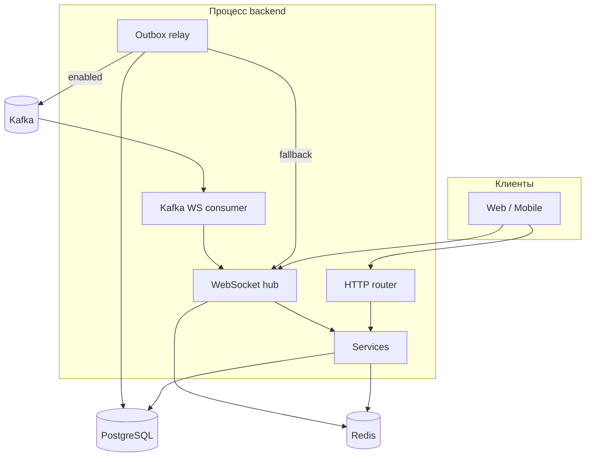
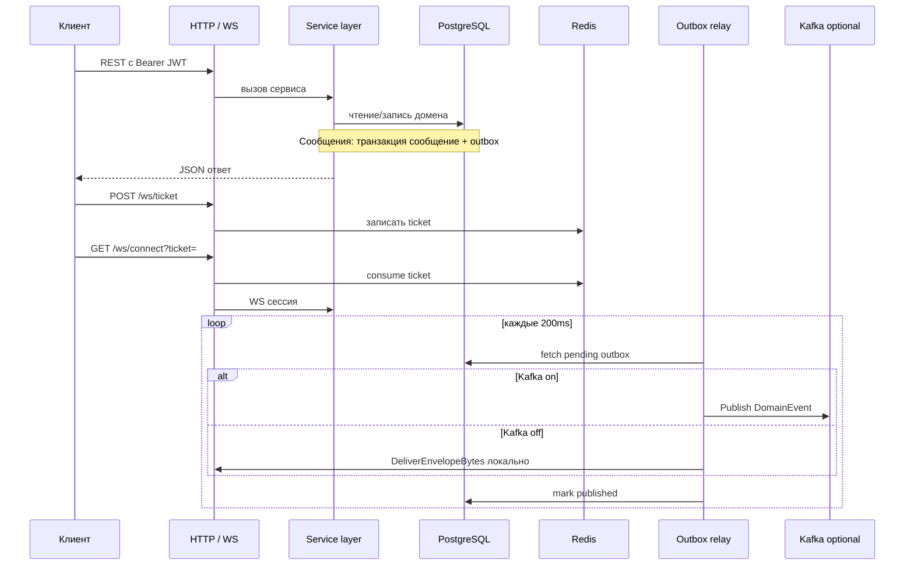

# Обзор проекта GoFlow (backend)

## Название и назначение

**GoFlow** — backend мессенджера на **Go**: HTTP API и WebSocket для чатов (direct/group), сообщений, аутентификации и realtime-событий. Репозиторий оформлен как монолит с чётким разделением слоёв (`transport` → `service` → `repository`).

## Бизнес-задача и пользователи

- **Задача:** дать клиентским приложениям (web, mobile, desktop) единый сервер для регистрации/логина, управления профилем, списка чатов, обмена сообщениями и realtime-уведомлений по WebSocket.
- **Пользователи системы:** конечные пользователи мессенджера (через клиенты); **потребители API** — frontend/mobile команды и интеграции, работающие по REST и WS.

## Что умеет backend (факт по коду)

- **Auth:** регистрация, логин, refresh (с ротацией refresh), logout / logout-all; JWT access + refresh-сессии в PostgreSQL.
- **Users:** профиль (`/users/me`), поиск, публичный просмотр пользователя по id.
- **Chats:** список, direct/group, участники, добавление/удаление участников.
- **Messages:** CRUD в разрезе чата, read receipt; для MVP валидация допускает преимущественно **text** и **system** (остальные типы в БД заложены, но сервис отклоняет).
- **WebSocket / realtime:** выдача одноразового ticket (Redis), подключение с ticket, hub на процесс, broadcast в участники чата; typing и presence через Redis; межпроцессная доставка — Redis Pub/Sub и/или Kafka (см. отдельные документы).
- **Redis:** обязателен по конфигурации (`redis.addr`); использование — ephemeral слой (не источник правды по домену).
- **Kafka + outbox:** опционально (`kafka.enabled`); при выключенном Kafka outbox relay доставляет события **локально** в `Broadcaster` без брокера.
- **Observability:** Prometheus-метрики на `GET /metrics`; структурированные логи; в `docker-compose` — Grafana, Loki, Alloy (см. `04_OBSERVABILITY_STACK.md`).

## Основные модули (пакеты)

| Область | Расположение | Роль |
|---------|--------------|------|
| Конфигурация | `internal/config` | YAML + env, валидация |
| Доменные константы/типы | `internal/domain` | ID, события, сущности без SQL |
| DTO | `internal/dto` | JSON контракты |
| Репозитории | `internal/repository`, `postgres/`, `redis/` | Доступ к данным |
| Сервисы | `internal/service` | Бизнес-правила |
| HTTP | `internal/transport/http` | Router, handlers, middleware, OpenAPI |
| WS | `internal/transport/ws` | Hub, handler, broadcaster |
| Kafka | `internal/kafka` | `DomainEvent`, producer |
| Воркеры | `internal/worker` | Outbox relay, Kafka → WS consumer |
| Миграции | `internal/migration` | Встроенные `.sql` |
| Метрики | `internal/observability/metrics` | Prometheus registry |
| Сборка приложения | `internal/app` | `Container`, `App` |

## Архитектура (как реализовано)

- **Modular monolith:** один процесс `cmd/app`, один HTTP-сервер, общий `Container` с зависимостями.
- **PostgreSQL** — источник правды для пользователей, чатов, сообщений, сессий обновления токена и **таблицы outbox** (`outbox_events`).
- **Redis** — ephemeral: presence (TTL), typing (TTL), WS tickets (SETNX + TTL + одноразовое потребление), Pub/Sub для fanout между инстансами **без** хранения истории сообщений.
- **Kafka** — при `kafka.enabled: true`: публикация сериализованных `DomainEvent` из relay; отдельный consumer в том же процессе читает топик и снова fanout в локальный WebSocket hub. При `false` события всё равно пишутся в outbox и отрабатываются через **локальный** fallback в `Broadcaster`.

## Поток данных (high level)

- **REST:** аутентификация через JWT middleware; часть маршрутов защищена rate limit **по IP** (in-memory token bucket, не Redis).
- **WebSocket:** сначала JWT → ticket в Redis, затем upgrade с одноразовым ticket; события чата доходят до клиентов через hub и при необходимости Redis Pub/Sub или Kafka consumer.

## Локальный запуск (кратко)

1. **Минимум:** PostgreSQL + Redis, переменные/`configs/local.yaml` с DSN и `redis.addr`, `JWT_SECRET` ≥ 16 символов.
2. Запуск из `backend/`: `go run ./cmd/app` с `CONFIG_PATH` на yaml (см. корневой README).
3. **Полный стек** (включая Kafka и observability): из `backend/deployments/` — `docker compose up --build`.

Подробнее: [README.md](../README.md).

## Текущее состояние (честно)

### Реализовано

- Полный контур auth/users/chats/messages + WS ticket + hub.
- Транзакционный outbox для событий сообщений и read receipt.
- Relay с переключением Kafka / локальная доставка.
- Redis-слой для presence, typing, tickets, Pub/Sub.
- Prometheus-метрики и middleware для HTTP/WS/auth/messages/outbox/Kafka.
- Миграции через `schema_migrations` и встроенный `embed` SQL.

### Частично / ограничения MVP

- Типы сообщений **image** / **file** объявлены в CHECK в БД, но **сервис** в MVP принимает в основном **text** и **system** (`validateMessageTypeForMVP` в `MessageService`).
- **Таблицы вложений (attachments)** в миграциях **нет** — медиа как продуктовая фича не доведена.
- Outbox relay: простой poll **200 ms**, при ошибке публикации строка **не** помечается опубликованной (повторные попытки); нет отдельной DLQ-таблицы в БД.
- Kafka consumer стартует с **FirstOffset** (удобно для dev; для prod может потребоваться иная политика).

### Вне текущего scope (не искать в миграциях)

- Отдельные микросервисы, sharding, multi-region.
- E2E encryption, moderation pipeline — не описаны в коде.

---

## Вывод

GoFlow backend — это монолитный Go-сервис с Postgres как основным хранилищем, Redis для ephemeral realtime и опциональной Kafka для переноса доменных событий между инстансами при включённом флаге.

## Что важно помнить

- Конфиг **требует** непустой `redis.addr` — без Redis приложение не стартует.
- События realtime для сообщений завязаны на **outbox**; Kafka не обязательна для работы в одном инстансе.

## Что можно улучшить позже

- Выровнять формулировки в корневом README (rate limit не в Redis).
- Политика offset для Kafka consumer по окружениям (dev vs prod).
- Расширить MVP на типы image/file при появлении хранилища вложений.
