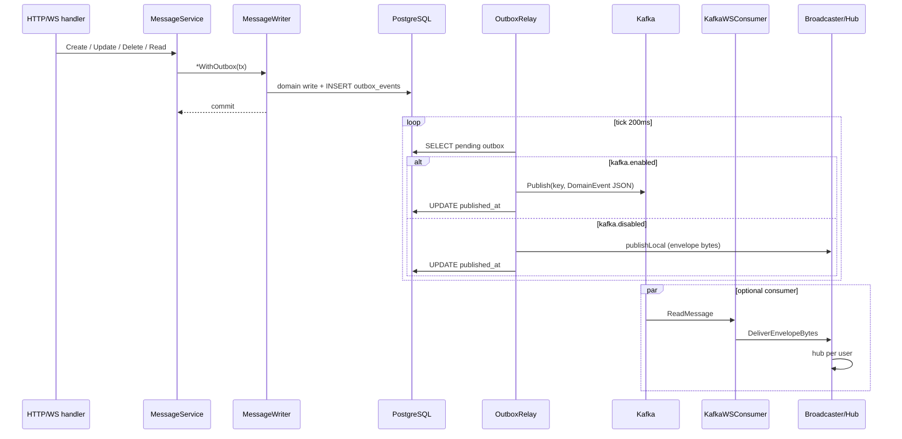

# Использование Kafka в GoFlow

Описание соответствует коду в `internal/kafka`, `internal/worker`, `internal/service/message_service.go`, `internal/repository/postgres/message_writer.go`, `internal/app/app.go` и конфигу `internal/config/config.go` / `configs/local.yaml`.

## Используется ли Kafka

**Опционально.** Флаг `kafka.enabled` (YAML) или `KAFKA_ENABLED` (env). В **`configs/local.yaml` по умолчанию `enabled: false`**. В **`backend/deployments/docker-compose.yml`** для сервиса `app` выставлено `KAFKA_ENABLED: ${KAFKA_ENABLED:-true}` — в docker-стеке Kafka обычно **включена**.

Без Kafka приложение **работает**: outbox relay публикует в **локальный** `Broadcaster` (ветка `publishLocal`), consumer не стартует.

## Зачем Kafka в этом проекте

- **Durable event transport:** событие после коммита транзакции в Postgres попадает в `outbox_events`, relay выталкивает JSON `DomainEvent` в топик.
- **Согласованная доставка между инстансами:** другой pod/процесс может читать тот же топик и fanout’ить в свой локальный WebSocket `Hub` (`KafkaWSConsumer`).
- **Не замена БД:** сообщения и outbox остаются в PostgreSQL; Kafka несёт **копию** уведомления для подписчиков.

## Где в коде

| Узел | Файл | Роль |
|------|------|------|
| Модель события | `internal/kafka/domain_event.go` | JSON-поля: `event_id`, `event_type`, `aggregate_*`, `chat_id`, `occurred_at`, `version`, `payload` |
| Producer | `internal/kafka/producer.go` | `kafka-go` Writer, `Balancer: Hash`, `RequiredAcks: RequireOne`, sync write |
| Relay | `internal/worker/outbox_relay.go` | Poll outbox → marshal `DomainEvent` → `Publish` или локальный fallback |
| Consumer | `internal/worker/kafka_ws_consumer.go` | Reader в отдельной горутине → `FanoutKafkaDomainEvent` → `DeliverEnvelopeBytes` |
| Fanout | `FanoutKafkaDomainEvent` | Разбор JSON → `MarshalEnvelope` → доставка в WS по `chat_id` |
| Старт воркеров | `internal/app/app.go` | При `Outbox != nil` всегда запускается relay; consumer — только если `Kafka.Enabled && producer != nil` |

## Outbox pattern

**Да, реализован:** запись в `outbox_events` в **той же транзакции**, что и изменение сообщений / read cursor (`MessageWriter` в `message_writer.go`). Отдельный relay **не** встраивает транзакцию с Kafka — классическая схема «сначала БД, потом брокер».

### Частичные ограничения реализации

- Relay опрашивает БД каждые **200 ms**, батч до **100** строк.
- При ошибке `Publish` строка **не** помечается `published_at` → повтор; нет отдельной таблицы ошибок/DLQ.
- `MarkPublished` после успешной публикации: при сбое между publish и UPDATE теоретически возможен дубликат в Kafka (идемпотентность на стороне consumer **не** доведена до offset-коммитов в одной транзакции с БД — это уровень MVP).

## Flow (текстом)

1. **Domain action** (создание/редактирование/удаление сообщения, read receipt) в `MessageService`.
2. **Запись в БД** + **insert в `outbox_events`** одной транзакцией (`MessageWriter`).
3. **Relay** читает `published_at IS NULL`, сериализует `DomainEvent`.
4. Если `UseKafka && Kafka != nil` → **Publish** в топик с ключом партиционирования (см. ниже). Иначе, если есть `chat_id` → **локальный** `Broadcaster` сразу с тем же смыслом события.
5. **Consumer** (если Kafka on) читает сообщения, строит WS envelope, шлёт в hub участникам чата (через членство из Postgres).

## Топик и ключ

- **Топик:** из конфига `kafka.topic`; если пусто, в коде подставляется **`goflow.domain.events`** (`applyKafkaDefaults`).
- **Ключ сообщения Kafka:** в relay — `ev.ChatID`, если пусто то `ev.AggregateID` (`outbox_relay.go`). Для текущих событий сообщений `chat_id` заполнен → партиции по чату (Hash balancer).

## Типы событий и payload

Константы в `internal/domain/realtime.go`:

- `message.created`, `message.updated`, `message.deleted`, `message.read_receipt`
- Агрегаты: `message`, `read_state`

Payload:

- **created:** формируется в writer после INSERT — JSON сообщения (wire-формат).
- **updated:** writer после UPDATE собирает payload из строки.
- **deleted / read_receipt:** JSON задаётся в `MessageService` до записи.

## Таблица событий

| Event Type | Откуда возникает | Где фиксируется | Как публикуется | Кто потребляет | Зачем нужен |
|------------|------------------|-----------------|-----------------|----------------|-------------|
| `message.created` | REST/WS создание сообщения | `messages` + `outbox_events` tx | Relay → Kafka **или** `Broadcaster` | WS клиенты чата (локально или через Kafka→hub) | Realtime новое сообщение |
| `message.updated` | PATCH текста | то же | то же | то же | Realtime редактирование |
| `message.deleted` | DELETE (soft) | то же | то же | то же | Realtime удаление |
| `message.read_receipt` | POST read | `chat_members` + outbox tx | то же | то же | Индикатор прочтения |

## Mermaid: outbox + Kafka

## Почему не Redis (раздел)

- Redis Pub/Sub в проекте решает **другой** слой (мгновенный broadcast между инстансами без записи в БД outbox). События из домена **сначала** надёжно фиксируются в Postgres outbox; Kafka читает уже готовый журнал outbox.

## Почему не PostgreSQL (раздел)

- LISTEN/NOTIFY или polling только БД не дают стандартного горизонтально масштабируемого log-транспорта с retention и consumer groups так, как это делает Kafka в связке с `kafka-go` Reader.

## Почему Kafka добавлена именно в эти сценарии, а не везде

- В топик попадают **только** события, для которых есть outbox из **MessageWriter** (сообщения + read receipt). Auth, профиль, создание чата **не** порождают запись в `outbox_events` в текущем коде.

## Что будет, если убрать Kafka

- Выставить `kafka.enabled: false` (как в локальном yaml): relay продолжит работать, доставка пойдёт через **`Fallback`** (`publishLocal`) в WebSocket **в том же процессе**.
- Multi-instance без Kafka: остаётся **Redis Pub/Sub** в `Broadcaster` для межпроцессного fanout (если Redis поднят), но это **не** тот же журнал, что Kafka.

## Ограничения и стоимость для MVP

- Нужен брокер, Zookeeper-образ в compose, больше RAM/CPU на dev-машине.
- Consumer group в коде **уникализируется** на процесс (`kafkaWSFanoutGroup` в `internal/app/kafka_fanout_group.go`) — важно понимать при масштабировании (каждый инстанс читает все партиции своей группой с уникальным суффиксом).

---

## Вывод

Kafka в GoFlow — **опциональный** транспорт для доменных событий сообщений/read receipt, записанных в **transactional outbox** в PostgreSQL; при отключении используется локальная доставка в WebSocket layer.

## Что важно помнить

- Локальный `configs/local.yaml` и docker-compose **расходятся по умолчанию** для `KAFKA_ENABLED` — это не баг документации, а разные профили.

## Что можно улучшить позже

- Идемпотентность consumer (event_id), DLQ, бэк-офф relay, настройка `StartOffset` по окружению.
- Расширение outbox на другие агрегаты (чаты, пользователи), если понадобится единый event stream.
