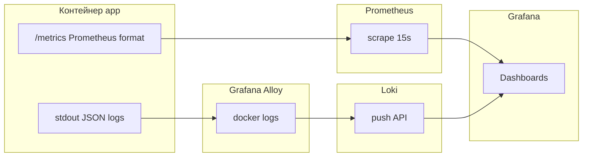

# Observability: Prometheus, Grafana, Loki, Grafana Alloy

Описание соответствует `backend/deployments/docker-compose.yml`, `backend/deployments/prometheus/prometheus.yml`, `backend/deployments/grafana/`, `backend/deployments/loki/`, `backend/deployments/alloy/config.alloy`, `internal/observability/metrics`, логированию через `slog` и корневому `README.md`.

## Какие инструменты есть

| Инструмент | Где задаётся | В compose |
|------------|--------------|-----------|
| **Prometheus** | `deployments/prometheus/prometheus.yml` | Сервис `prometheus`, порт **9090** |
| **Grafana** | `deployments/grafana/provisioning/` | Сервис `grafana`, порт хоста **`${GRAFANA_PORT:-3001}`** |
| **Loki** | `deployments/loki/loki-config.yaml` | Сервис `loki`, порт **3100** |
| **Grafana Alloy** | `deployments/alloy/config.alloy` | Сервис `alloy`, HTTP **12345** |

Приложение **backend** экспонирует **`GET /metrics`** (Prometheus text) и пишет логи в **stdout** (в docker-compose для `app` задан `LOG_FORMAT: json`).

## Задача каждого компонента

- **Prometheus** — сбор **числовых временных рядов** (счётчики, гистограммы, gauge): запросы, latency-классы, WS, auth, сообщения, outbox relay, Kafka consumer.
- **Loki** — хранение и запрос **логов** (LogQL), индекс по меткам.
- **Grafana Alloy** — **агент сбора логов** контейнеров Docker: читает docker socket, пушит в Loki (`loki.source.docker` → `loki.write`). В проекте **нет Promtail** — комментарий в `config.alloy`.
- **Grafana** — единая **визуализация**: datasource Prometheus (default) + Loki; готовые дашборды из provisioning.

## Monitoring vs logging

- **Monitoring (метрики):** агрегация, алерты по порогам, RED/USE на уровне сервиса; мало кардинальности (маршруты нормализованы где возможно).
- **Logging:** текст/JSON событий с контекстом для **расследования** единичных запросов, correlation по времени и pod/container.

## Почему Prometheus для метрик

- Pull-модель scrape с `app:8080/metrics` из сети compose (`prometheus.yml` job `backend`).
- Экспозиция через `promhttp` на отдельном registry (`internal/observability/metrics`).

Собираемые **имена** метрик (основные):

- HTTP: `http_requests_total`, `http_request_duration_seconds`, `http_requests_inflight`
- WS: `ws_active_connections`, `ws_events_inbound_total`, `ws_events_outbound_total`, `ws_handler_errors_total`
- Auth: `auth_register_attempts_total`, `auth_login_attempts_total`, `auth_refresh_attempts_total`, `auth_failures_total`
- Сообщения: `messages_created_total`, `messages_updated_total`, `messages_deleted_total`, `messages_read_receipts_total`
- Outbox: `outbox_events_created_total`, `outbox_relay_iterations_total`, `outbox_relay_publish_success_total`, `outbox_relay_publish_failures_total`
- Kafka: `kafka_consumer_events_handled_total`, `kafka_consumer_handler_failures_total`
- Плюс стандартные Go/process collectors.

## Почему Loki для логов

- Логи приложения остаются в stdout; Loki получает **централизованный** поток через Alloy с метками Docker (в README указано использование метки `container_name`, подбор `.*app.*` для сервиса `app`).

## Почему Grafana как точка входа

- Один UI для графиков метрик и панелей логов; datasources прописаны в `grafana/provisioning/datasources/datasources.yaml` (uid `prometheus`, `loki`).

## Как данные доходят до Grafana

## Дашборды (provisioning)

Файлы в `backend/deployments/grafana/dashboards/`:

- `backend-overview.json`
- `realtime-messaging.json`
- `logs-overview.json`

Папка в Grafana (из README): **GoFlow** — дашборды *Backend Overview*, *Realtime / Messaging*, *Logs Overview*.

## Чем это лучше «просто docker logs»

- История и поиск по логам (LogQL), связка времени с метриками на одной шкале в Grafana.
- Метрики outbox/Kafka/WS без ручного grep по stdout.

## Почему не одна система

- Loki **не** заменяет Prometheus для latency histogram и счётчиков запросов без избыточной индексации числовых рядов.
- Prometheus **не** хранит полные тексты логов и не заточен под полнотекст по полям JSON.

## Почему не только логи

- По логам сложно строить **агрегаты** «p95 latency за час» без отдельного pipeline; метрики это дают из коробки.

## Почему не только метрики

- Метрики не покажут точное тело ошибки, stack в объёме лога, шаг бизнес-логики без высокой кардинальности.

## Почему Grafana + Prometheus + Loki вместе

- Grafana связывает симптом на графике (спайк `outbox_relay_publish_failures_total`) с конкретными записями логов за тот же интервал.

## Таблица инструментов

| Инструмент | Что собирает | Откуда | Зачем нужен | Что будет без него |
|------------|--------------|--------|-------------|-------------------|
| Prometheus | Метрики scrape | `GET http://app:8080/metrics` | Тренды, SLO, алерты | Нет стандартных графиков нагрузки |
| Loki | Логи | Push от Alloy | Поиск по логам, корреляция | Только локальный `docker logs` |
| Alloy | Логи контейнеров | Docker socket | Доставка в Loki без Promtail | Вручную настраивать другой shipper |
| Grafana | Визуализация | Prometheus + Loki datasources | Единый UI | Разрозненные UIs/API |

## Что даёт стек для MVP и для production-like

- **MVP:** быстрый дебаг WS/Kafka/outbox, демонстрация зрелости архитектуры.
- **Production-like:** основа для алертинга (Rule manager не развёрнут в compose — можно добавить), контроль кардинальности меток.

## Проблемы, которые стек помогает решать

| Проблема | Как помогает |
|-----------|----------------|
| Дебаг HTTP | `http_requests_total`, duration, логи middleware |
| Ошибки auth | `auth_failures_total` + логи |
| WS / realtime | `ws_*` метрики + realtime dashboard |
| Kafka / outbox | `outbox_*`, `kafka_*` + логи relay/consumer |
| Производительность | Histogram latency, inflight |

---

## Вывод

В `docker-compose` развёрнут стандартный стек **метрики (Prometheus) + логи (Loki через Alloy) + UI (Grafana)**; приложение интегрировано через `/metrics` и stdout.

## Что важно помнить

- Scrape в Prometheus настроен на хост **`app:8080`** внутри compose-сети; локально без compose — поднять Prometheus вручную и поправить `targets`.

## Что можно улучшить позже

- Alertmanager и recording rules.
- Трассировка (OpenTelemetry), если появится требование к distributed tracing.
