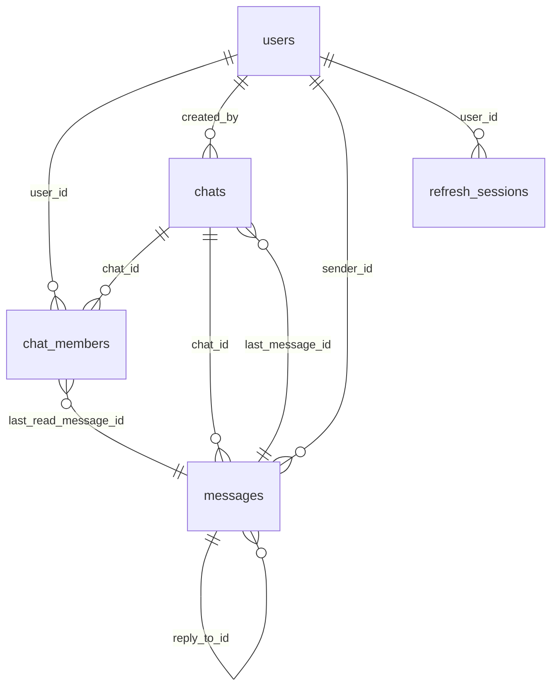

# Структуры PostgreSQL (миграции GoFlow)

Источник правды: файлы `backend/internal/migration/*.sql` (порядок применения — **лексикографический** по имени файла, см. `runner.go`). Дополнительно создаётся таблица **`schema_migrations`** в `migration.Up` (не в отдельном `.sql`).

Модуль кода: репозитории в `internal/repository/postgres/` должны соответствовать этой схеме.

## ER-обзор (Mermaid)

Таблица **`outbox_events`** связана логически с `chats` через `chat_id` (FK в SQL **не** объявлен — допускает NULL для будущих типов событий).

## Сводная таблица

| Таблица | Назначение | Основные связи | Используется где |
|---------|------------|----------------|------------------|
| `users` | Учётные записи и профиль | PK `id` | Auth, UserService, FK из chats/members/messages/sessions |
| `chats` | Диалог/группа | `created_by` → users; `last_message_id` → messages | ChatService, WS broadcast membership |
| `chat_members` | Участие в чате | PK `(chat_id, user_id)` | Список участников, read cursor, роли |
| `messages` | Сообщения | `chat_id`, `sender_id`, `reply_to_id` | MessageService, outbox payload |
| `refresh_sessions` | Refresh-токены (хэш) | `user_id` → users | AuthService / Sessions repo |
| `outbox_events` | Transactional outbox | опционально `chat_id` uuid | OutboxRelay, MessageWriter |
| `schema_migrations` | Версии применённых миграций | — | `internal/migration/runner.go` |

**Таблицы `attachments` в миграциях нет** — вложения как продукт не реализованы на уровне схемы.

---

## `schema_migrations`

Создаётся кодом мигратора, не `.sql` файлом.

| Поле | Тип | NOT NULL | PK/FK | Описание |
|------|-----|----------|-------|----------|
| `version` | text | да | PK | Имя файла миграции, например `001_init_users.sql` |
| `applied_at` | timestamptz | да | | Время применения |

---

## `users`

**Назначение:** пользователь мессенджера: email, пароль (хэш), никнейм, профиль, активность.

| Поле | Тип | NOT NULL | PK/FK | Описание |
|------|-----|----------|-------|----------|
| `id` | uuid | да | PK, default `gen_random_uuid()` | Идентификатор пользователя |
| `email` | varchar(320) | да | | Уникальность по `lower(email)` (индекс) |
| `password_hash` | varchar(255) | да | | Хэш пароля |
| `nickname` | varchar(64) | да | | Отображаемое имя |
| `first_name` | varchar(100) | нет | | Профиль |
| `last_name` | varchar(100) | нет | | Профиль |
| `avatar_url` | text | нет | | URL аватара |
| `created_at` | timestamptz | да, default now() | | Создание |
| `updated_at` | timestamptz | да, default now() | | Обновление |
| `last_seen_at` | timestamptz | нет | | Активность (не путать с Redis presence) |
| `is_active` | boolean | да, default true | | Мягкая деактивация учётки |

**Индексы:** `uq_users_email_lower` UNIQUE на `lower(email)`; `idx_users_created_at`; частичные `last_seen_at`, `is_active`.

**Soft delete:** поля `deleted_at` **нет**; комментарий в миграции — hard delete на уровне приложения «если понадобится».

**Связи:** referenced из `chats.created_by`, `chat_members.user_id`, `messages.sender_id`, `refresh_sessions.user_id`.

---

## `chats`

**Назначение:** чат типа direct или group, метаданные и ссылка на последнее сообщение.

| Поле | Тип | NOT NULL | PK/FK | Описание |
|------|-----|----------|-------|----------|
| `id` | uuid | да | PK | Идентификатор чата |
| `type` | text | да | | `direct` \| `group` (CHECK) |
| `title` | varchar(255) | нет | | Для group |
| `avatar_url` | text | нет | | |
| `created_by` | uuid | нет | FK → `users(id)` ON DELETE SET NULL | Создатель |
| `created_at` | timestamptz | да | | |
| `updated_at` | timestamptz | да | | |
| `last_message_id` | uuid | нет | FK → `messages(id)` ON DELETE SET NULL | Денормализация хвоста |
| `last_message_at` | timestamptz | нет | | |
| `is_deleted` | boolean | да, default false | | Soft delete чата |
| `direct_key` | varchar(64) | нет | | Обязателен для direct (CHECK) |

**Индексы:** уникальный `direct_key` для активных direct; индексы по `created_by`, `last_message_at`, `type`, частичный на удалённые.

**Связи:** `chat_members`, `messages`; FK на `messages` добавлен в миграции `003`.

---

## `chat_members`

**Назначение:** состав чата, роль, персональные флаги, курсор прочтения.

| Поле | Тип | NOT NULL | PK/FK | Описание |
|------|-----|----------|-------|----------|
| `chat_id` | uuid | да | PK, FK → `chats` CASCADE | |
| `user_id` | uuid | да | PK, FK → `users` CASCADE | |
| `role` | text | да | | `owner` \| `admin` \| `member` |
| `joined_at` | timestamptz | да, default now() | | |
| `last_read_message_id` | uuid | нет | FK → `messages` ON DELETE SET NULL | Read receipt уровня member |
| `last_read_at` | timestamptz | нет | | |
| `is_muted` | boolean | да, default false | | |
| `is_archived` | boolean | да, default false | | |
| `is_pinned` | boolean | да, default false | | |

**Индексы:** по `user_id`, составной `(user_id, is_archived)`, частичный по pinned.

---

## `messages`

**Назначение:** сообщение в чате; soft delete на уровне строки.

| Поле | Тип | NOT NULL | PK/FK | Описание |
|------|-----|----------|-------|----------|
| `id` | uuid | да | PK | |
| `chat_id` | uuid | да | FK → `chats` CASCADE | |
| `sender_id` | uuid | да | FK → `users` RESTRICT | Защита от удаления пользователя с сообщениями |
| `type` | text | да | | `text` \| `image` \| `file` \| `system` (CHECK в БД) |
| `text` | text | нет | | Тело (для text/system и т.д.) |
| `reply_to_id` | uuid | нет | FK self ON DELETE SET NULL | Тред |
| `created_at` | timestamptz | да | | |
| `updated_at` | timestamptz | да | | |
| `deleted_at` | timestamptz | нет | | Soft delete сообщения |

**Индексы:** `(chat_id, created_at DESC)` только для `deleted_at IS NULL`; индексы по sender, reply, удалённые.

**Расхождение с кодом:** в SQL допустимы типы `image`/`file`, но **`MessageService`** в MVP отклоняет типы кроме `text` и `system` (`validateMessageTypeForMVP`). То есть **схема шире**, чем текущая бизнес-логика.

---

## `refresh_sessions`

**Назначение:** хранение refresh-сессий (хэш токена), срок действия, отзыв.

| Поле | Тип | NOT NULL | PK/FK | Описание |
|------|-----|----------|-------|----------|
| `id` | uuid | да | PK | |
| `user_id` | uuid | да | FK → `users` CASCADE | |
| `token_hash` | varchar(128) | да | UNIQUE | Не сырой токен |
| `user_agent` | text | нет | | |
| `ip_address` | varchar(45) | нет | | |
| `expires_at` | timestamptz | да | | |
| `created_at` | timestamptz | да | | |
| `revoked_at` | timestamptz | нет | | Logout / rotation |

**Индексы:** уникальный `token_hash`; поиск по `user_id`, активные сессии, `expires_at`.

---

## `outbox_events`

**Назначение:** transactional outbox для публикации доменных событий (relay → Kafka или локальный fanout).

| Поле | Тип | NOT NULL | PK/FK | Описание |
|------|-----|----------|-------|----------|
| `id` | bigserial | да | PK | Суррогат для relay |
| `event_id` | uuid | да | UNIQUE | Идемпотентность на уровне домена |
| `event_type` | text | да | | `message.*`, `message.read_receipt` |
| `aggregate_type` | text | да | | |
| `aggregate_id` | text | да | | Строковый id сущности |
| `chat_id` | uuid | нет | | Для партиционирования Kafka и fanout |
| `occurred_at` | timestamptz | да | | |
| `version` | int | да, default 1 | | |
| `payload` | jsonb | да | | Тело события |
| `published_at` | timestamptz | нет | | NULL = ожидает relay |
| `created_at` | timestamptz | да, default now() | | |

**Индексы:** частичный `idx_outbox_unpublished` по `id` где `published_at IS NULL`.

**FK на `chats` нет** — допускает гибкость, но текущий код сообщений всегда задаёт `chat_id`.

---

## Связь таблиц с модулями backend

| Модуль / сервис | Таблицы |
|-----------------|---------|
| Auth / Sessions | `users`, `refresh_sessions` |
| Users | `users` |
| Chats | `chats`, `chat_members` |
| Messages + outbox writer | `messages`, `chats` (last message), `chat_members` (read), `outbox_events` |
| Outbox relay | `outbox_events` (чтение/обновление) |

---

## Код и миграции

- **Согласовано:** `MessageWriter` вставляет в `outbox_events` столбцы, совпадающие с миграцией `005_outbox_events.sql`.
- **Расшождение по смыслу:** CHECK на `messages.type` шире, чем проверка в `MessageService` для MVP.
- **Нет в миграциях:** отдельных таблиц для вложений, push-устройств, audit log — не документировать как существующие.

---

## Вывод

База содержит шесть доменных областей таблиц (`users`, `chats`, `chat_members`, `messages`, `refresh_sessions`, `outbox_events`) плюс служебную `schema_migrations`. Вложений на уровне SQL нет.

## Что важно помнить

- Порядок миграций: `001` users → `002` chats/members → `003` messages + FK на chats/members → `004` sessions → `005` outbox.

## Что можно улучшить позже

- Таблица `attachments` + FK из `messages`, когда появится загрузка файлов.
- FK `outbox_events.chat_id` → `chats(id)` (опционально), если все события останутся чат-скоупными.
